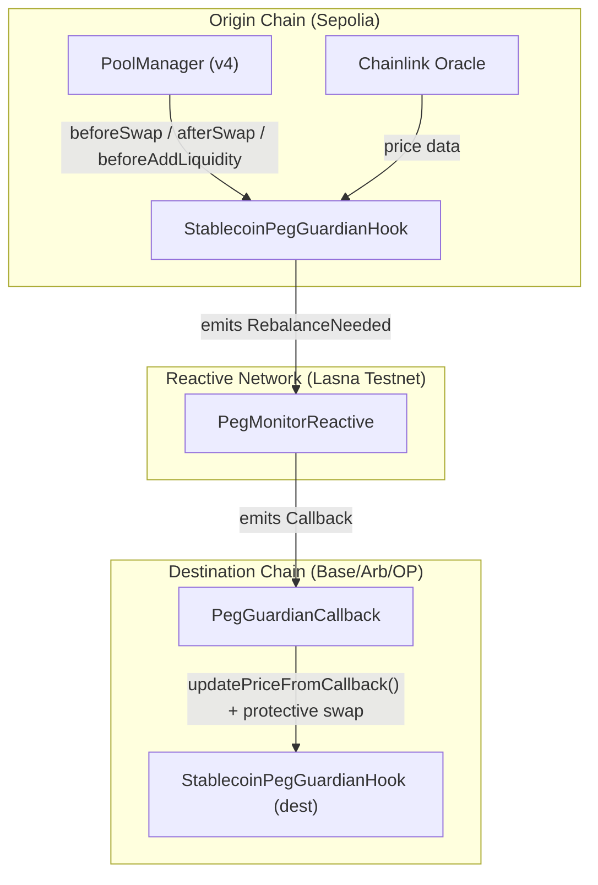

# Stablecoin Peg Guardian Hook

A production-grade Uniswap v4 hook that protects stablecoin pools (USDC, USDT, DAI, etc.) through dynamic fees, auto-rebalancing, segmented order flow, and Reactive Network cross-chain peg protection. Built for the UHI8 Hookathon and the Reactive Network sponsor prize track.

## Core Features
- **Dynamic Fees**: Adjusts fees from 0–100 bps based on peg deviation via `beforeSwap`. Overrides LP fees dynamically using `OVERRIDE_FEE_FLAG`.
- **Auto-Rebalancing Detection**: Checks after every swap (`afterSwap`) if deviation exceeds 50 bps. If so, emits a `RebalanceNeeded` event to trigger cross-chain rebalancing.
- **Segmented Order Flow**: Automatically targets large retail/institutional orders (≥$100k) with an additional 20 bps surcharge to suppress volatility. Normalizes token decimals (6, 8, 18) for accurate threshold comparisons.
- **Cross-Chain Protection (Reactive Network)**: Subscribes to `RebalanceNeeded` events on the origin chain via `PegMonitorReactive` and emits callbacks to destination chains using `PegGuardianCallback`, which executes protective swaps.
- **Chainlink Oracle Integration**: Auto-fetches fresh price data before every swap via `updatePriceFromOracle()`. Supports configurable staleness thresholds.
- **Production-Ready & Secure**: Adheres to the Uniswap Security Best Practices Checklist, features full unit/fuzz/invariant testing, gas optimized (<150k gas per swap), and utilizes inline 2-step ownership to avoid diamond inheritance issues.
- **Built-in Dashboard**: Includes a Next.js front-end for monitoring real-time peg status, fee charts, and recent protective swaps.

## Architecture



## Partner Integrations

### Reactive Network
Cross-chain peg protection using Reactive Smart Contracts (RSCs). The Reactive Network monitors events on the origin chain and triggers callbacks on destination chains.

| Component | File | Description |
|-----------|------|-------------|
| Reactive Monitor | [`src/reactive/PegMonitorReactive.sol`](src/reactive/PegMonitorReactive.sol) | Deployed on Reactive Network (Lasna testnet). Subscribes to `RebalanceNeeded` events emitted by the hook and triggers cross-chain callbacks. |
| Callback Contract | [`src/reactive/PegGuardianCallback.sol`](src/reactive/PegGuardianCallback.sol) | Deployed on the destination chain (Sepolia). Receives callbacks from PegMonitorReactive, updates the hook's price, and executes a protective swap. |
| Interface | [`src/interfaces/IReactivePegGuardian.sol`](src/interfaces/IReactivePegGuardian.sol) | Shared interface defining the events and callback signatures used across chains. |

### Chainlink (Oracle)
Price feed integration for real-time peg deviation monitoring.

| Component | File | Description |
|-----------|------|-------------|
| Oracle Integration | [`src/StablecoinPegGuardianHook.sol`](src/StablecoinPegGuardianHook.sol) (lines 415–470) | `updatePriceFromOracle()` fetches Chainlink price data, normalizes to 18 decimals, and updates the hook's internal price. Auto-called in `_beforeSwap`. |
| Oracle Interface | [`src/interfaces/AggregatorV3Interface.sol`](src/interfaces/AggregatorV3Interface.sol) | Standard Chainlink `AggregatorV3Interface` for `latestRoundData()`. |

## Project Structure

```
src/
├── StablecoinPegGuardianHook.sol   # Core v4 hook (dynamic fees, segmented flow, oracle)
├── BaseHook.sol                     # Custom base hook (avoids diamond inheritance)
├── interfaces/
│   ├── AggregatorV3Interface.sol    # Chainlink oracle interface
│   ├── IERC20Metadata.sol           # Token decimals interface
│   └── IReactivePegGuardian.sol     # Cross-chain peg guardian interface
├── reactive/
│   ├── PegMonitorReactive.sol       # Reactive Network event monitor
│   └── PegGuardianCallback.sol      # Destination chain callback + protective swap
└── mocks/
    └── MockERC20.sol                # Test ERC20 tokens

test/
├── StablecoinPegGuardianHook.t.sol          # 31 unit tests
├── ChainlinkOracle.t.sol                    # 18 oracle tests
├── PegGuardianCallback.t.sol                # 10 callback tests
├── StablecoinPegGuardianHook.fuzz.t.sol     # 9 fuzz tests
├── StablecoinPegGuardianHook.gas.t.sol      # 8 gas benchmarks
└── StablecoinPegGuardianHook.invariant.t.sol # 6 invariant tests

script/
├── Deploy.s.sol            # Hook deployment + pool init + optional Safe transfer
├── DeployReactive.s.sol    # Callback + Reactive monitor deploy
├── DeployTokens.s.sol      # Mock token deployment
├── ExecuteSwap.s.sol       # Test swap execution
└── HookMiner.sol           # CREATE2 salt miner for flag-encoded addresses

frontend/                   # Next.js dashboard (peg status, fees, admin panel)
```

## Testnet Deployments

| Contract | Network | Address |
|----------|---------|---------|
| StablecoinPegGuardianHook | Sepolia | `0x67F3Bd11b7f80Dc867B60CB06a89f478F0f8C8c0` |
| PegGuardianCallback | Sepolia | `0xC35528AF7B27C9537F090cC6027149d047B9c586` |
| PegMonitorReactive | Lasna (Reactive) | `0x2e601349b30cCD0347B4cca470e61bAC453C538d` |
| Chainlink USDC/USD Feed | Sepolia | `0xA2F78ab2355fe2f984D808B5CeE7FD0A93D5270E` |

## Foundry Usage

### Build

```shell
forge build
```

### Test

Unit, fuzz, invariant, and gas tests cover deviation math, fee bounds, admin functions, oracle integration, and callback flows.
```shell
forge test
```

### Gas Snapshots

```shell
forge snapshot
```

### Deploy

```shell
# Deploy hook + pool
forge script script/Deploy.s.sol --rpc-url $SEPOLIA_RPC_URL --private-key $PRIVATE_KEY --broadcast -vvv

# Deploy Reactive contracts
forge script script/DeployReactive.s.sol:DeployCallback --rpc-url $SEPOLIA_RPC_URL --private-key $PRIVATE_KEY --broadcast -vvv
forge script script/DeployReactive.s.sol:DeployReactiveMonitor --rpc-url $REACTIVE_RPC_URL --private-key $PRIVATE_KEY --broadcast -vvv
```

## Frontend

```shell
cd frontend
npm install
npm run dev
```

Dashboard shows real-time peg status, dynamic fee visualization, recent swap events, and an admin panel for owner controls (pause, update price, set oracle).

## Security

- 2-step ownership transfer (no single-tx takeover)
- Emergency pause gate on all hook entry points
- Chainlink oracle staleness checks with configurable threshold
- All external calls protected with `try/catch`
- No upgradeable proxies — immutable hook
- Full NatSpec documentation
- Gas optimized (<150k per swap path)

## License

MIT
