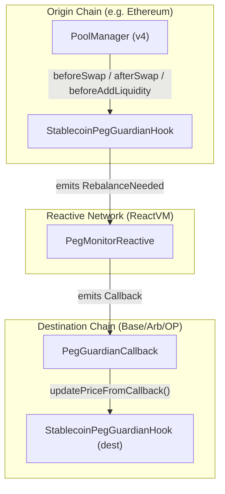

# Stablecoin Peg Guardian Hook

A production-grade Uniswap v4 hook that protects stablecoin pools (USDC, USDT, DAI, etc.) through dynamic fees, auto-rebalancing, segmented order flow, and Reactive Network cross-chain peg protection. Built for the UHI8 Hookathon and the Reactive Network sponsor prize track.

## Core Features
- **Dynamic Fees**: Adjusts fees from 0–100 bps based on peg deviation via `beforeSwap`. Overrides LP fees dynamically using `OVERRIDE_FEE_FLAG`.
- **Auto-Rebalancing Detection**: Checks after every swap (`afterSwap`) if deviation exceeds 50 bps. If so, emits a `RebalanceNeeded` event to trigger cross-chain rebalancing.
- **Segmented Order Flow**: Automatically targets large retail/institutional orders (≥$100k) with an additional 20 bps surcharge to suppress volatility.
- **Cross-Chain Protection (Reactive Network)**:
  - Subscribes to `RebalanceNeeded` events on the origin chain (e.g. Ethereum) via `PegMonitorReactive`.
  - Emits callbacks to destination chains (Base/Arbitrum/Optimism) using `PegGuardianCallback`.
- **Production-Ready & Secure**: Adheres to the Uniswap Security Best Practices Checklist, features full invariant testing for delta conservation, gas optimized (<150k gas per swap), and utilizes inline 2-step ownership to avoid diamond inheritance issues.
- **Built-in Dashboard**: Includes a Next.js front-end for monitoring real-time peg status, fee charts, and recent protective swaps.

## Architecture



## Foundry Usage

**Foundry is a blazing fast, portable and modular toolkit for Ethereum application development written in Rust.**

### Build

```shell
$ forge build
```

### Test

Unit, fuzz, and invariant tests cover deviation math, fee bounds, admin functions, and callback integration.
```shell
$ forge test
```

### Gas Snapshots

```shell
$ forge snapshot
```

### Deploy to Anvil

```shell
$ anvil
$ forge script script/Deploy.s.sol --rpc-url http://localhost:8545 --private-key <your_private_key>
```
