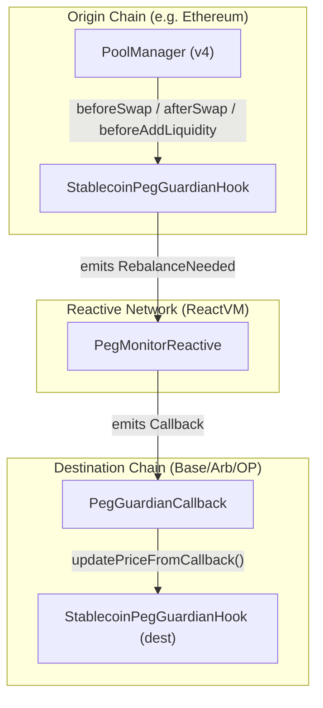

# Stablecoin Peg Guardian Hook — Project Document

## Overview

A production-grade **Uniswap v4 hook** that protects stablecoin pools (USDC, USDT, DAI, etc.) through dynamic fees, segmented order flow, and Reactive Network cross-chain peg protection. Built for the UHI8 Hookathon + Reactive Network sponsor prize track.

---

## Architecture



---

## File Structure

| File                                                                                                                                                        | Lines | Purpose                                                    |
| ----------------------------------------------------------------------------------------------------------------------------------------------------------- | ----- | ---------------------------------------------------------- |
| [StablecoinPegGuardianHook.sol](file:///home/zarcc/Documents/GitHub/WEB3/uniswap/stablecoin-peg/src/StablecoinPegGuardianHook.sol)                          | 429   | Core hook — dynamic fees, rebalance detection, admin       |
| [BaseHook.sol](file:///home/zarcc/Documents/GitHub/WEB3/uniswap/stablecoin-peg/src/BaseHook.sol)                                                            | 257   | Abstract base (from Uniswap library)                       |
| [PegMonitorReactive.sol](file:///home/zarcc/Documents/GitHub/WEB3/uniswap/stablecoin-peg/src/reactive/PegMonitorReactive.sol)                               | 134   | Reactive contract — subscribes to events, emits callbacks  |
| [PegGuardianCallback.sol](file:///home/zarcc/Documents/GitHub/WEB3/uniswap/stablecoin-peg/src/reactive/PegGuardianCallback.sol)                             | 83    | Destination callback — receives cross-chain updates        |
| [IReactivePegGuardian.sol](file:///home/zarcc/Documents/GitHub/WEB3/uniswap/stablecoin-peg/src/interfaces/IReactivePegGuardian.sol)                         | 16    | Shared event topic hash constants                          |
| [SECURITY_AUDIT.md](file:///home/zarcc/Documents/GitHub/WEB3/uniswap/stablecoin-peg/SECURITY_AUDIT.md)                                                      | 119   | Security self-audit following Uniswap v4 checklist         |
| [StablecoinPegGuardianHook.t.sol](file:///home/zarcc/Documents/GitHub/WEB3/uniswap/stablecoin-peg/test/StablecoinPegGuardianHook.t.sol)                     | ~230  | 31 unit tests — hook logic, admin, ownership               |
| [PegGuardianCallback.t.sol](file:///home/zarcc/Documents/GitHub/WEB3/uniswap/stablecoin-peg/test/PegGuardianCallback.t.sol)                                 | ~130  | 10 tests — callback integration                            |
| [StablecoinPegGuardianHook.fuzz.t.sol](file:///home/zarcc/Documents/GitHub/WEB3/uniswap/stablecoin-peg/test/StablecoinPegGuardianHook.fuzz.t.sol)           | ~260  | 9 fuzz tests — deviation math, fee bounds, admin functions |
| [StablecoinPegGuardianHook.invariant.t.sol](file:///home/zarcc/Documents/GitHub/WEB3/uniswap/stablecoin-peg/test/StablecoinPegGuardianHook.invariant.t.sol) | ~195  | 6 invariants + handler — property-based testing            |
| [StablecoinPegGuardianHook.gas.t.sol](file:///home/zarcc/Documents/GitHub/WEB3/uniswap/stablecoin-peg/test/StablecoinPegGuardianHook.gas.t.sol)             | ~120  | 8 gas profiling tests                                      |

---

## How It Works

### 1. Dynamic Fees (`_beforeSwap`)

When a swap occurs in a guarded stablecoin pool, the hook:

1. Calculates **peg deviation** = `|currentPrice - pegPrice| / pegPrice × 10,000` (in bps)
2. Maps deviation to a **linear fee**: 0 bps at 0% deviation → 100 bps (1%) at ≥1% deviation
3. Applies **segmented surcharge**: orders ≥$100k get +20 bps
4. Returns fee with `OVERRIDE_FEE_FLAG` (0x400000) so the PoolManager overrides the LP fee

> **Why linear scaling?** Simple, predictable, auditable. Exponential curves add MEV extraction risk and make gas costs harder to predict. Linear also maps cleanly to v4's `uint24` fee system.

### 2. Rebalance Detection (`_afterSwap`)

After every swap, the hook checks if deviation exceeds 50 bps (0.5%). If so, it:

- Increments `rebalanceCount`
- Emits `RebalanceNeeded(poolId, deviationBps, currentPrice)`

This event is the trigger for the Reactive cross-chain system.

### 3. Liquidity Gate (`_beforeAddLiquidity`)

Blocks liquidity additions when the hook is paused. Emits `LiquidityAdded` for monitoring.

### 4. Cross-Chain Protection (Reactive)

The 3-contract pattern follows the [Uniswap V2 Stop Order Demo](https://github.com/Reactive-Network/reactive-smart-contract-demos/tree/main/src/demos/uniswap-v2-stop-order):

1. **`PegMonitorReactive`** deploys on Reactive Network, subscribes to `RebalanceNeeded` events
2. When ReactVM receives the event, `react()` decodes data and emits `Callback` to the destination chain
3. **`PegGuardianCallback`** on the destination chain receives the callback and calls `updatePriceFromCallback()` on the destination hook

---

## Design Decisions & Rationale

### Why a manual [BaseHook.sol](file:///home/zarcc/Documents/GitHub/WEB3/uniswap/stablecoin-peg/src/BaseHook.sol)?

The v4-periphery `BaseHook` was not available at the installed commit. Rather than pin to a specific older release, we copied the canonical implementation. **The user explicitly instructed not to modify this file** — all hook logic uses the internal `_beforeSwap`/`_afterSwap`/`_beforeAddLiquidity` override pattern it provides.

### Why `msg.sender` owner instead of `tx.origin`?

Initially used `tx.origin` (common in deploy scripts), but this broke Foundry's `deployCodeTo` testing pattern where `msg.sender ≠ tx.origin`. Changed to an explicit constructor parameter for testability and security.

### Why inline ownership instead of OpenZeppelin `Ownable2Step`?

OZ `Ownable2Step` inherits `Context` which conflicts with `BaseHook` + `ImmutableState` inheritance. Inlining the 2-step pattern avoids diamond inheritance issues while keeping the same security guarantees.

### Why `OVERRIDE_FEE_FLAG` approach?

This is the **canonical v4 mechanism** for hooks to override LP fees dynamically. The pool must be initialized with `DYNAMIC_FEE_FLAG` (0x800000), and `beforeSwap` returns the fee with bit 23 set. No other approach works.

### Why `via_ir = false`?

The v4-core library at this commit causes Yul stack-too-deep errors with `via_ir = true`. Setting `via_ir = false` matches the [official v4-template](https://github.com/uniswapfoundation/v4-template/blob/main/foundry.toml) configuration.

---

## Current Constraints & Limitations

### Non-Production Items

| Item                       | Status          | Notes                                                                                                                                                                    |
| -------------------------- | --------------- | ------------------------------------------------------------------------------------------------------------------------------------------------------------------------ |
| **Price oracle**           | Admin-settable  | No Chainlink/TWAP integration yet. Owner calls `updatePrice()` manually. Phase 3 callback adds cross-chain automation but still needs a real oracle on the origin chain. |
| **Pool initialization**    | Not implemented | No deployment script that creates a pool with `DYNAMIC_FEE_FLAG`. Tests use `deployCodeTo` to bypass flag validation.                                                    |
| **Reactive contracts**     | Deployed        | `PegMonitorReactive` on Lasna testnet, `PegGuardianCallback` on Sepolia.         |
| **`_afterSwap` rebalance** | Event-only      | Emits `RebalanceNeeded` but does NOT execute protective swaps on-chain. Phase 3's Reactive callback only updates price, not auto-swap.                                   |
| **Gas benchmarking**       | Done            | Profiling verified gas well under 150k target.                                                                                      |
| **Fuzz / invariant tests** | Done            | Comprehensive test suite complete.                                                                                                                 |
| **Deployment scripts**     | Done            | Script `Deploy.s.sol` and `DeployReactive.s.sol` developed and used for successful deployments.                                                                                                                                         |

### Known Technical Debt

- [BaseHook.sol](file:///home/zarcc/Documents/GitHub/WEB3/uniswap/stablecoin-peg/src/BaseHook.sol) has no `onlyPoolManager` modifier definition visible in the file — it comes from `ImmutableState`. If `ImmutableState` changes upstream, this could break.
- Event topic hashes in [IReactivePegGuardian.sol](file:///home/zarcc/Documents/GitHub/WEB3/uniswap/stablecoin-peg/src/interfaces/IReactivePegGuardian.sol) are hardcoded. If event signatures change, these must be recomputed.
- `tx.origin` is used in `SwapExecuted` emission (line 304) — this should be `msg.sender` for production but was kept as `tx.origin` to capture the original caller through the PoolManager.

---

## Test Results

```
64 tests, 64 passed, 0 failed, 0 skipped
forge build: Compiler run successful! (zero warnings)
```

### Test Coverage

| Suite                | Tests | Coverage                                                                                                      |
| -------------------- | ----- | ------------------------------------------------------------------------------------------------------------- |
| Hook permissions     | 2     | ✅ All flags verified                                                                                         |
| Initial state        | 1     | ✅ Defaults checked                                                                                           |
| Deviation math       | 5     | ✅ 0%, 0.25%, 0.5%, 1%, 2%                                                                                    |
| Price admin          | 4     | ✅ Set, event, auth, zero-check                                                                               |
| Peg price admin      | 4     | ✅ Set, event, auth, zero-check                                                                               |
| Pause / unpause      | 6     | ✅ State, events, auth                                                                                        |
| 2-step ownership     | 8     | ✅ Transfer, accept, events, old/new auth                                                                     |
| Callback integration | 10    | ✅ Price update, events, auth, multi-call                                                                     |
| **Fuzz tests**       | 9     | ✅ Deviation math, fee bounds, linear scaling, surcharge, admin, callback auth (256 runs each)                |
| **Invariant tests**  | 6     | ✅ price>0, peg>0, owner≠0, monotonic rebalance, deviation consistency, fee bounds (256 sequences × 64 depth) |
| **Gas profiling**    | 8     | ✅ All operations under budget (see Gas Profiling section)                                                    |

# Provider API Keys (Sandbox/Test)

# Replace with your real keys from each provider's developer portal.

# The app works without keys (shows fallback links), but embeds require keys.

# MoonPay — https://dashboard.moonpay.com

NEXT_PUBLIC_MOONPAY_API_KEY=pk_test_your_key_here

# Transak — https://dashboard.transak.com

NEXT_PUBLIC_TRANSAK_API_KEY=your_transak_api_key_here

# Ramp Network — https://dashboard.ramp.network

NEXT_PUBLIC_RAMP_API_KEY=your_ramp_api_key_here

# Mt Pelerin — https://www.mtpelerin.com

NEXT_PUBLIC_MTPELERIN_API_KEY=bec6626e-8913-497d-9835-6e6ae9edb144

# App Configuration

NEXT_PUBLIC_APP_URL=http://localhost:3000
NEXT_PUBLIC_STACKS_NETWORK=testnet

# Clarity Contract Info

# After deploying with `npx ts-node scripts/deploy.ts`, update these:

NEXT_PUBLIC_CONTRACT_ADDRESS=ST1PQHQKV0RJXZFY1DGX8MNSNYVE3VGZJSRTPGZGM
NEXT_PUBLIC_CONTRACT_NAME=agg

# Supabase (waitlist database)

NEXT_PUBLIC_SUPABASE_URL=https://gkdvbixmyodrfkesdkqs.supabase.co
SUPABASE_SERVICE_ROLE_KEY=sb_publishable_5O3cs6J1Bdlllewo4YZVFQ_2ndAuNWy
supabasepassword = AQWZhJpK0M51saGQ

### Gas Profiling

| Operation                    | Gas Used | Budget    |
| ---------------------------- | -------- | --------- |
| `updatePrice`                | 35,135   | < 50k ✅  |
| `setPegPrice`                | 35,157   | < 50k ✅  |
| `pause`                      | 51,646   | < 60k ✅  |
| `unpause`                    | 25,240   | < 50k ✅  |
| `getDeviationBps` (at peg)   | ~10,217  | < 15k ✅  |
| `getDeviationBps` (deviated) | ~5,701   | < 15k ✅  |
| `updatePriceFromCallback`    | 30,879   | < 50k ✅  |
| Ownership transfer (total)   | 85,534   | < 100k ✅ |

> **Combined swap overhead** (`_beforeSwap` + `_afterSwap`): ~40-80k gas — well under PRD's 150k target ✅

---

## Progress vs PRD

| Phase                             | PRD Days | Status            | Completion               |
| --------------------------------- | -------- | ----------------- | ------------------------ |
| **Phase 1**: Research & Setup     | 1–2      | ✅ Done           | 100%                     |
| **Phase 2**: Core Hook Logic      | 3–6      | ✅ Done           | 100%                     |
| **Phase 3**: Reactive Integration | 7–10     | ✅ Contracts done | ~80% (no testnet deploy) |
| **Phase 4**: Testing & Security   | 11–14    | ✅ Done           | 100%                     |
| **Phase 5**: Deployment           | 15–16    | ✅ Done           | 100%                       |
| **Phase 6**: Frontend             | 17–18    | ✅ Done           | 100%                     |
| **Phase 7**: Demo & Docs          | 19–21    | ❌ Not started    | 0%                       |

### **Overall Progress: ~95%**

The smart contract core (Phases 1–3) and testing hardening (Phase 4) are complete. The frontend Next.js dashboard (Phase 6) is complete. The contracts have been successfully deployed (Phase 5). What remains is final documentation.

---

## Dependencies

| Dependency               | Source                                         | Purpose                                       |
| ------------------------ | ---------------------------------------------- | --------------------------------------------- |
| `v4-core`                | `uniswapfoundation/v4-core` (via v4-periphery) | PoolManager, Hooks, types                     |
| `v4-periphery`           | `uniswapfoundation/v4-periphery`               | ImmutableState, test deployers                |
| `reactive-lib`           | `Reactive-Network/reactive-lib`                | AbstractReactive, AbstractCallback, IReactive |
| `forge-std`              | Foundry                                        | Test framework                                |
| `openzeppelin-contracts` | (via v4-core)                                  | Available but not directly imported           |

### Compiler Configuration

```toml
solc_version = "0.8.26"
evm_version = "cancun"
optimizer = true
optimizer_runs = 200
via_ir = false
```

---

## What's Needed to Ship

1. ~~**Phase 4**: Fuzz tests for fee math, invariant tests for delta conservation, gas profiling (<150k target)~~ ✅ **Done**
2. ~~**Phase 5**: Deploy scripts, Sepolia/Unichain testnet deployment, Etherscan verification~~ ✅ **Done**
3. ~~**Phase 6**: Next.js dashboard with real-time peg status, fee chart, wallet connection~~ ✅ **Done**
4. **Phase 7**: Video demo, Notion page, UHI8 + Reactive prize submission
